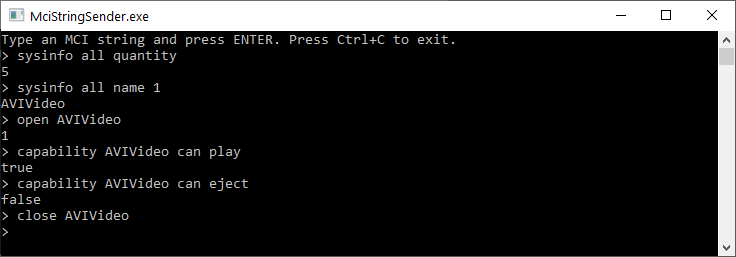

# MciStringSender

A simple console application that can be used to send [Multimedia command strings](https://docs.microsoft.com/en-us/windows/win32/multimedia/multimedia-command-strings) to Media Control Interface ([MCI](https://docs.microsoft.com/en-us/windows/win32/multimedia/mci)).




### Points of interest

* [MciStringSender.cs](src/MciStringSender/MciStringSender.cs) - a simple wrapper around [mciSendString](https://docs.microsoft.com/en-us/previous-versions/dd757161(v=vs.85)) and [mciGetErrorString](https://docs.microsoft.com/en-us/previous-versions/dd757158(v=vs.85)) Windows API functions.

```
var mciRequest = Console.ReadLine();

if (mciRequest != null)
{
    var mciStringSender = new MciStringSender();
    
    if (mciStringSender.TrySendString(mciRequest, out var mciResponse))
    {
        if (!String.IsNullOrEmpty(mciResponse))
        {
            Console.WriteLine(mciResponse);
        }
    }
    else
    {
        Console.WriteLine($"Error {mciStringSender.LastErrorCode} '{mciStringSender.LastErrorString}'");
    }
}
```

* [MciPlayer.cs](src/MciStringSender/MciPlayer.cs) - a helper class that uses `MciStringSender` class to play multimedia files.
